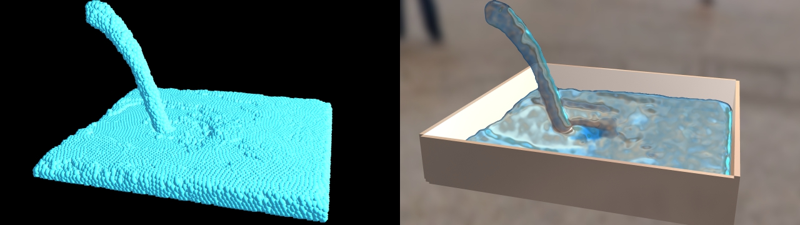

# TD-ScreenSpaceFluid

## Ref
http://developer.download.nvidia.com/presentations/2010/gdc/Direct3D_Effects.pdf

https://www.geeks3d.com/20100809/siggraph-2010-screen-space-fluid-rendering-for-games/

## To-do
- Optimization (done in one or two `GLSL MAT`)
- Volumetric Absorption

## Author

Yea Chen (yeataro)

https://github.com/yeataro

yeataro@gmail.com